# GST/ITR Bot — System Flow Diagrams

> All diagrams use [Mermaid](https://mermaid.js.org/) syntax.
> View them on GitHub, VS Code (Mermaid extension), or paste into [mermaid.live](https://mermaid.live).

---

## 1. High-Level Architecture


---

## 2. WhatsApp Bot — Master State Machine


---

## 3. GST Filing Flow (WhatsApp)


---

## 4. ITR Computation Flow (WhatsApp)


---

## 5. ITR Document Upload & Merge Flow


---

## 6. REST API Flows (Mobile / Web)

### 6a. GST Filing via REST API


### 6b. ITR Compute + Download via REST API


---

## 7. Invoice Parsing Pipeline


---

## 8. NIL Filing Flow (MasterGST Sandbox)


---

## 9. Complete REST API Endpoint Map


---

## 10. Session Data Structure


---

## 11. CA REST API Flow (Mobile / Web)


---

## 12. e-Invoice Flow (Phase 6)


---

## 13. e-WayBill Flow (Phase 6)


---

## 14. Small-Segment Guided Wizard (Phase 7)


---

## 15. Medium-Segment Credit Check (Phase 7)

```mermaid
flowchart TD
    START["User selects<br/>Monthly Filing<br/>(medium segment)"] --> CHECK[MEDIUM_CREDIT_CHECK]

    CHECK -->|"auto-run"| IMPORT["Import GSTR-2B<br/>via gstr2b_service"]
    IMPORT --> RECON["Run reconciliation<br/>Match invoices"]
    RECON --> RESULT[MEDIUM_CREDIT_RESULT]

    RESULT -->|"1 Continue filing"| FILING["GST_PERIOD_MENU<br/>Regular filing flow"]
    RESULT -->|"2 View mismatches"| DETAIL["Show mismatch details:<br/>⚠️ Value mismatches<br/>📤 Missing in 2B<br/>📥 Missing in books"]
    RESULT -->|"3 Notify suppliers"| NOTIFY["📨 Send notification<br/>about missing invoices"]

    DETAIL -->|"1 Continue"| FILING
    NOTIFY --> RESULT

    style CHECK fill:#FF9800,color:#fff
    style RESULT fill:#9C27B0,color:#fff
    style FILING fill:#4CAF50,color:#fff
```



---

## 16. Multi-GSTIN Management (Phase 8)


---

## 17. Refund & Notice Flow (Phase 9)


---

## 18. Notification Settings (Phase 10)


---

## 19. Handler Chain Architecture


---

## Quick Reference: State Transition Table

| From State | User Input | To State | Action |
|---|---|---|---|
| MAIN_MENU | 1 | GST_MENU | Show GST services |
| MAIN_MENU | 2 | ITR_MENU | Show ITR services |
| MAIN_MENU | 3 | WAIT_INVOICE_UPLOAD | Prompt for image/PDF |
| MAIN_MENU | 4 | LANG_MENU | Show 5 languages |
| MAIN_MENU | 5 | TAX_QA | Start AI Q&A |
| MAIN_MENU | 6 | INSIGHTS_MENU | Show analytics options |
| MAIN_MENU | 7 | BATCH_UPLOAD | Start batch mode |
| GST_MENU | 1 | WAIT_GSTIN | Ask for GSTIN |
| GST_MENU | 2 | GST_FILING_MENU | Show filing options |
| GST_MENU | 3 | HSN_LOOKUP | Ask for product |
| GST_MENU | 4 | NIL_FILING_MENU | Show NIL options |
| GST_FILING_MENU | 1 | GST_FILING_CONFIRM | Preview GSTR-3B |
| GST_FILING_MENU | 2 | GST_FILING_CONFIRM | Preview GSTR-1 |
| GST_FILING_MENU | 3 | NIL_FILING_MENU | NIL shortcut |
| GST_FILING_CONFIRM | YES | MAIN_MENU | Submit to MasterGST |
| NIL_FILING_MENU | 1/2/3 | NIL_FILING_CONFIRM | Confirm form type |
| NIL_FILING_CONFIRM | YES | MAIN_MENU | File NIL return |
| ITR_MENU | 1 | ITR1_ASK_SALARY | Start ITR-1 |
| ITR_MENU | 2 | ITR4_ASK_TYPE | Start ITR-4 |
| ITR_MENU | 3 | ITR_DOC_TYPE_MENU | Upload documents |
| ITR1_ASK_SALARY | number | ITR1_ASK_OTHER_INCOME | Store salary |
| ITR1_ASK_OTHER_INCOME | number | ITR1_ASK_80C | Store other income |
| ITR1_ASK_80C | number | ITR1_ASK_80D | Store 80C |
| ITR1_ASK_80D | number | ITR1_ASK_TDS | Store 80D |
| ITR1_ASK_TDS | number | ITR_FILING_DOWNLOAD | Compute + show result |
| ITR4_ASK_TYPE | 1/2 | ITR4_ASK_TURNOVER | Set biz/prof type |
| ITR4_ASK_TURNOVER | number | ITR4_ASK_80C | Store turnover |
| ITR4_ASK_80C | number | ITR4_ASK_TDS | Store 80C |
| ITR4_ASK_TDS | number | ITR_FILING_DOWNLOAD | Compute + show result |
| ITR_DOC_TYPE_MENU | 1/2/3 | ITR_DOC_UPLOAD | Set doc type |
| ITR_DOC_UPLOAD | image/pdf | ITR_DOC_REVIEW | Parse + merge |
| ITR_DOC_REVIEW | 1 | ITR_DOC_TYPE_MENU | Upload another |
| ITR_DOC_REVIEW | 2 | ITR_DOC_EDIT_FIELD | Edit a field |
| ITR_DOC_REVIEW | 3 | ITR_DOC_PICK_ITR | Choose ITR form |
| ITR_DOC_EDIT_FIELD | "N val" | ITR_DOC_REVIEW | Update field |
| ITR_DOC_PICK_ITR | 1/2 | ITR_FILING_DOWNLOAD | Compute + show result |
| ITR_FILING_DOWNLOAD | 4 | MAIN_MENU | Send PDF via WhatsApp |
| ITR_FILING_DOWNLOAD | 5 | MAIN_MENU | Send JSON via WhatsApp |
| ITR_FILING_DOWNLOAD | 0 | MAIN_MENU | Skip download |
| LANG_MENU | 1-5 | MAIN_MENU | Set language |
| TAX_QA | text | TAX_QA | AI answer + loop |
| TAX_QA | 0 | MAIN_MENU | Exit Q&A |
| Any State | 0 | MAIN_MENU | Global home |
| Any State | 9 | (previous) | Pop navigation stack |
| **Phase 6: e-Invoice** | | | |
| EINVOICE_MENU | 1 | EINVOICE_UPLOAD | Upload invoice for IRN |
| EINVOICE_MENU | 2 | EINVOICE_STATUS_ASK | Check IRN status |
| EINVOICE_MENU | 3 | EINVOICE_CANCEL | Cancel IRN |
| EINVOICE_UPLOAD | upload | EINVOICE_CONFIRM | Review parsed invoice |
| EINVOICE_CONFIRM | yes | EINVOICE_MENU | Generate IRN |
| **Phase 6: e-WayBill** | | | |
| EWAYBILL_MENU | 1 | EWAYBILL_UPLOAD | Upload for EWB |
| EWAYBILL_MENU | 2 | EWAYBILL_TRACK_ASK | Track EWB |
| EWAYBILL_MENU | 3 | EWAYBILL_VEHICLE_ASK | Update vehicle |
| EWAYBILL_UPLOAD | upload | EWAYBILL_TRANSPORT | Enter transport details |
| EWAYBILL_TRANSPORT | details | EWAYBILL_MENU | Generate EWB |
| **Phase 7: Segment Flows** | | | |
| SMALL_WIZARD_SALES | "done" | SMALL_WIZARD_PURCHASES | Move to purchases |
| SMALL_WIZARD_PURCHASES | "done" | SMALL_WIZARD_CONFIRM | Show summary |
| SMALL_WIZARD_CONFIRM | 1 | MAIN_MENU | Send to CA |
| MEDIUM_CREDIT_CHECK | auto | MEDIUM_CREDIT_RESULT | Run 2B + reconcile |
| MEDIUM_CREDIT_RESULT | 1 | GST_PERIOD_MENU | Continue filing |
| MEDIUM_CREDIT_RESULT | 2 | MEDIUM_CREDIT_RESULT | View mismatches |
| **Phase 8: Multi-GSTIN** | | | |
| MULTI_GSTIN_MENU | 1 | MULTI_GSTIN_ADD | Add GSTIN |
| MULTI_GSTIN_MENU | 3 | MULTI_GSTIN_SUMMARY | View summary |
| MULTI_GSTIN_ADD | valid GSTIN | MULTI_GSTIN_LABEL | Enter label |
| MULTI_GSTIN_LABEL | text | MULTI_GSTIN_MENU | Save + return |
| **Phase 9: Refund & Notice** | | | |
| REFUND_MENU | 1 | REFUND_TYPE | Select refund type |
| REFUND_TYPE | 1/2/3 | REFUND_DETAILS | Enter amount |
| REFUND_DETAILS | amount | MAIN_MENU | Create claim |
| NOTICE_MENU | 1 | NOTICE_MENU | List notices |
| NOTICE_MENU | 2 | NOTICE_UPLOAD | Upload notice |
| **Phase 10: Notifications** | | | |
| NOTIFICATION_SETTINGS | 1-5 | SETTINGS_MENU | Save preferences |

---

## 20. Upload Security Pipeline

```mermaid
flowchart TD
    UPLOAD["User uploads file<br/>(image/PDF/Excel)"] --> EMPTY{"Empty<br/>payload?"}
    EMPTY -->|yes| REJECT1["❌ Rejected:<br/>Empty file"]
    EMPTY -->|no| FNAME{"Filename<br/>safe?"}

    FNAME -->|path traversal/null bytes| REJECT2["❌ Rejected:<br/>Unsafe filename"]
    FNAME -->|safe| MIME{"MIME type<br/>allowed?"}

    MIME -->|not in allowlist| REJECT3["❌ Rejected:<br/>Invalid file type"]
    MIME -->|allowed| SIZE{"File size<br/>within limit?"}

    SIZE -->|>10MB image / >25MB PDF| REJECT4["❌ Rejected:<br/>File too large"]
    SIZE -->|ok| MAGIC{"Magic bytes<br/>match MIME?"}

    MAGIC -->|mismatch| REJECT5["❌ Rejected:<br/>File disguised"]
    MAGIC -->|match| PDF_CHECK{"Is PDF?"}

    PDF_CHECK -->|no| PASS["✅ Safe to process"]
    PDF_CHECK -->|yes| MALWARE{"Scan for<br/>malware patterns"}

    MALWARE -->|/JavaScript /Launch etc.| REJECT6["❌ Rejected:<br/>Suspicious PDF"]
    MALWARE -->|clean| PASS

    style PASS fill:#4CAF50,color:#fff
    style REJECT1 fill:#F44336,color:#fff
    style REJECT2 fill:#F44336,color:#fff
    style REJECT3 fill:#F44336,color:#fff
    style REJECT4 fill:#F44336,color:#fff
    style REJECT5 fill:#F44336,color:#fff
    style REJECT6 fill:#F44336,color:#fff
```

---

## 21. PII Masking Flow

```mermaid
flowchart LR
    INPUT["Raw text with<br/>sensitive data"] --> GSTIN_MASK["Mask GSTINs<br/>36AABCU9603R1ZM<br/>→ 36**********1ZM"]
    GSTIN_MASK --> PAN_MASK["Mask PANs<br/>AABCU9603R<br/>→ AA*****03R"]
    PAN_MASK --> PHONE_MASK["Mask phones<br/>+919876543210<br/>→ +91*****3210"]
    PHONE_MASK --> BANK_MASK["Mask bank accts<br/>1234567890<br/>→ ******7890"]
    BANK_MASK --> OUTPUT["Safe text<br/>for logs"]

    style INPUT fill:#F44336,color:#fff
    style OUTPUT fill:#4CAF50,color:#fff
```

---

## 22. Books vs Portal Comparison

```mermaid
flowchart TD
    subgraph "Data Sources"
        BOOKS["Accounting Books<br/>(User invoices in DB)"]
        PORTAL["GST Portal<br/>(GSTR-1 / GSTR-2B)"]
    end

    BOOKS --> COMPARE{"Compare with<br/>₹1 tolerance"}
    PORTAL --> COMPARE

    COMPARE --> MATCHED["✅ Matched<br/>(within tolerance)"]
    COMPARE --> VALUE["⚠️ Value Mismatch<br/>(amounts differ)"]
    COMPARE --> MISS_PORTAL["📤 Missing in Portal<br/>(in books, not filed)"]
    COMPARE --> MISS_BOOKS["📥 Missing in Books<br/>(in portal, not recorded)"]

    MATCHED --> SUMMARY["Comparison Summary<br/>matched/mismatched/missing<br/>counts + totals"]
    VALUE --> SUMMARY
    MISS_PORTAL --> SUMMARY
    MISS_BOOKS --> SUMMARY

    SUMMARY --> WA["WhatsApp<br/>formatted report"]
    SUMMARY --> API["REST API<br/>JSON response"]

    style MATCHED fill:#4CAF50,color:#fff
    style VALUE fill:#FF9800,color:#fff
    style MISS_PORTAL fill:#F44336,color:#fff
    style MISS_BOOKS fill:#9C27B0,color:#fff
```

---

## 23. Pending ITC Lifecycle

```mermaid
flowchart TD
    IMPORT["GSTR-2B Import<br/>(JSON/Excel/PDF)"] --> RECON["Invoice Reconciliation<br/>Books vs 2B"]

    RECON --> MATCHED["✅ Matched<br/>ITC available"]
    RECON --> UNMATCHED["⚠️ Unmatched<br/>Missing in 2B"]

    UNMATCHED --> PENDING["Pending ITC Bucket<br/>Track per period"]

    PENDING --> AGE{"Age of<br/>pending ITC"}
    AGE -->|"1 period"| BUCKET1["🟢 Recent<br/>(1 period)"]
    AGE -->|"2-3 periods"| BUCKET2["🟡 Aging<br/>(2-3 periods)"]
    AGE -->|"4+ periods"| BUCKET3["🔴 Critical<br/>(4+ periods)"]

    BUCKET1 --> FOLLOWUP["Generate vendor<br/>follow-up message"]
    BUCKET2 --> FOLLOWUP
    BUCKET3 --> FOLLOWUP

    FOLLOWUP --> WA["Send via WhatsApp<br/>to supplier"]

    PENDING --> CARRY["Carry forward<br/>to next period"]
    CARRY --> PENDING

    style MATCHED fill:#4CAF50,color:#fff
    style UNMATCHED fill:#FF9800,color:#fff
    style BUCKET3 fill:#F44336,color:#fff
```

---

## 24. Audit Trail Flow

```mermaid
flowchart TD
    ACTION["Admin/CA accesses<br/>client data"] --> LOG["log_access()<br/>actor, action, resource"]

    LOG --> BUFFER["In-memory ring buffer<br/>(max 10,000 entries)"]
    LOG --> STRUCT["Structured log file<br/>(persistent)"]

    BUFFER --> API_RECENT["GET /api/v1/audit/recent<br/>Filtered by actor/action/GSTIN"]
    BUFFER --> API_CLIENT["GET /api/v1/audit/client/{gstin}<br/>Access summary per actor"]

    style LOG fill:#2196F3,color:#fff
    style BUFFER fill:#FF9800,color:#fff
    style STRUCT fill:#4CAF50,color:#fff
```

---

## 25. Global Commands Flow

```mermaid
flowchart TD
    MSG["Incoming WhatsApp<br/>message"] --> G0{"Text is<br/>'0'?"}
    G0 -->|yes| MAIN["→ MAIN_MENU"]
    G0 -->|no| G9{"Text is<br/>'9'?"}

    G9 -->|yes| BACK["→ Pop stack<br/>(go back)"]
    G9 -->|no| NIL{"Text is<br/>'NIL'?"}

    NIL -->|yes| NILF["→ NIL_FILING_MENU"]
    NIL -->|no| HELP{"Text is<br/>'help' or '?'?"}

    HELP -->|yes| HELP_MSG["Show command<br/>reference card"]
    HELP -->|no| RESTART{"Text is<br/>'restart'?"}

    RESTART -->|yes| RESET["Clear session<br/>→ MAIN_MENU"]
    RESTART -->|no| CA{"Text is<br/>'ca'?"}

    CA -->|yes| HANDOFF["CA handoff<br/>acknowledgment"]
    CA -->|no| STATE["Continue to<br/>state machine"]

    style MAIN fill:#2196F3,color:#fff
    style HELP_MSG fill:#4CAF50,color:#fff
    style RESET fill:#FF9800,color:#fff
    style HANDOFF fill:#9C27B0,color:#fff
```

---

## 26. GSTR-2B Multi-Format Import

```mermaid
flowchart TD
    subgraph "Input Formats"
        JSON["JSON<br/>(GST Portal API)"]
        EXCEL["Excel .xlsx<br/>(Downloaded file)"]
        PDF["PDF<br/>(Scanned/downloaded)"]
    end

    JSON --> PARSE_JSON["Direct JSON parsing<br/>import_gstr2b()"]
    EXCEL --> PARSE_EXCEL["openpyxl parsing<br/>import_gstr2b_from_excel()"]
    PDF --> PARSE_PDF["pdfplumber + regex<br/>import_gstr2b_from_pdf()"]

    PARSE_JSON --> STORE["Store as<br/>Gstr2bInvoice records"]
    PARSE_EXCEL --> STORE
    PARSE_PDF --> STORE

    STORE --> RECON["Run reconciliation<br/>against books"]
    RECON --> ITC["Update ITC<br/>match status"]

    style JSON fill:#4CAF50,color:#fff
    style EXCEL fill:#2196F3,color:#fff
    style PDF fill:#FF9800,color:#fff
```
